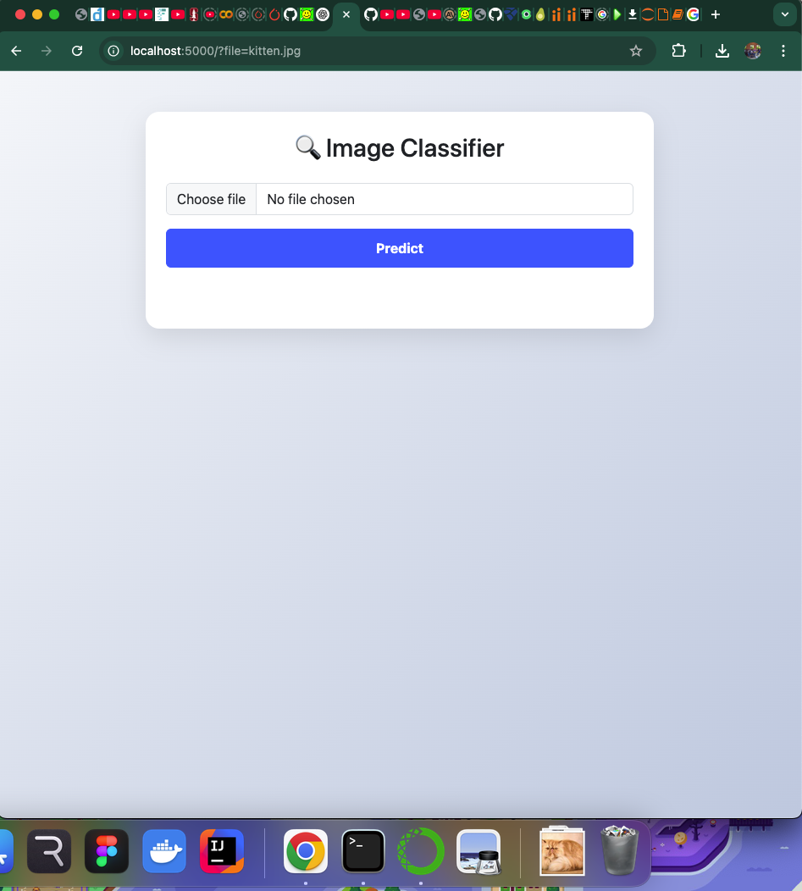
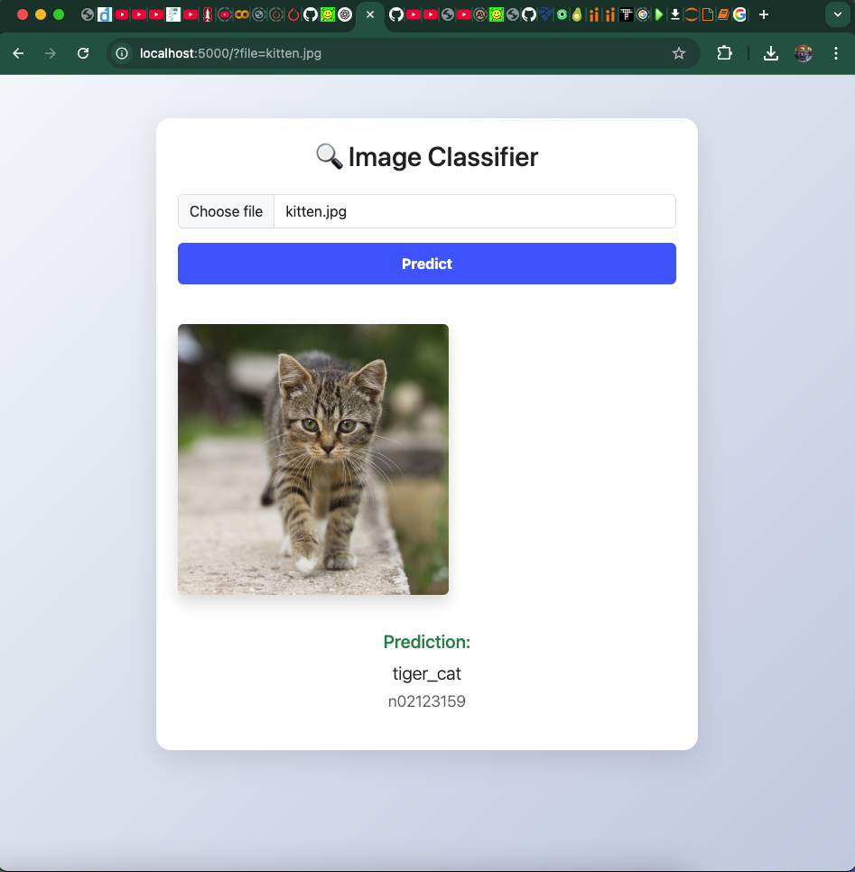
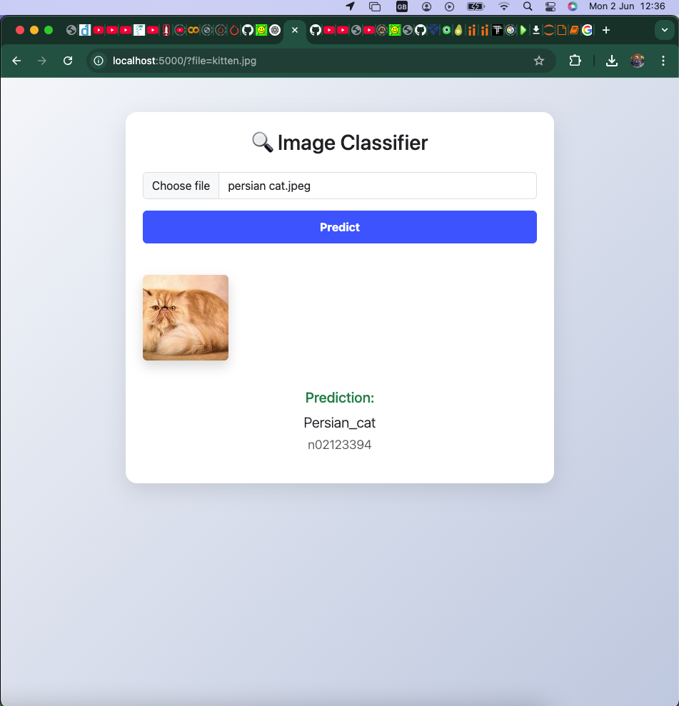

# Image Classifier Web App

A beautiful, minimalistic web interface to classify images using a deep learning model. Upload an image of an object, and the app returns the most likely classification with confidence — powered by a Flask backend and Bootstrap frontend.

<p align="center">
  
  
  
  
</p>

---

## ✨ Demo

Here’s a preview of how the web interface looks:

<p align="center">
  
</p>

---

## 🐾 Example Predictions

| Image              | Predicted Label       | Class ID |
|--------------------|-----------------------|----------|
|  | `tiger_cat`           | `n02123159` |
|  | `Persian_cat`        | `n02123394` |

> 🧠 These predictions are generated using a pretrained ImageNet model (e.g., ResNet).

---

## 🚀 How to Run Locally

### 🔧 Requirements

- Python 3.7+
- pip
- `torch`, `torchvision`, `flask`

### 🛠️ Installation

```bash
git clone https://github.com/GeraldWambui/ImageClassifierDenseNet.git
cd ImageClassifierDenseNet
pip install -r requirements.txt
